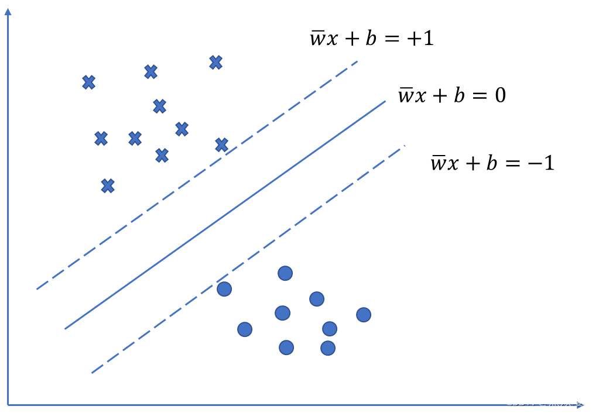
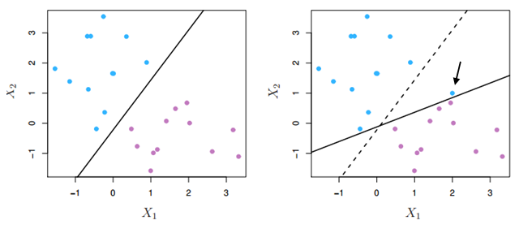
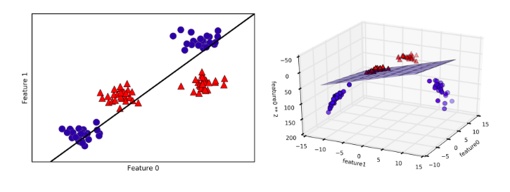
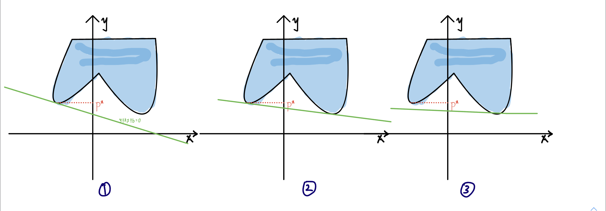
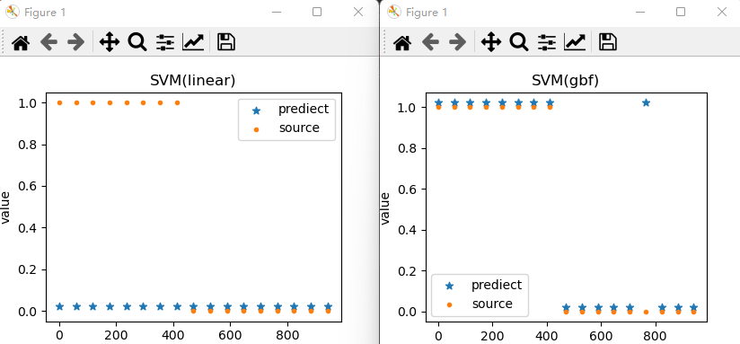
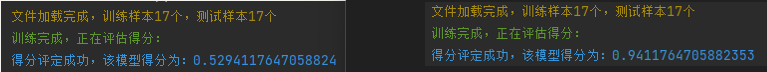

# Support Vector Machines

## Introduce:

​		Support Vector Machines，翻译过来就是支持向量机。说实话把，从这个名字上来看，除了向量两个字，其它的都不知道在说啥。不过，没关系，我们来一点一点的看这个东西到底讲了一个啥。首先呢，我们要明确一点，就是他是解决一个分类的问题。这个算法，我思考了将近一个月，终于弄明白了，下面我们来看一下。

## Derivation：

### Problem description:

​		至于分类问题，说白了就是给定一个特征向量，我们通过一个函数的映射，将它映射到一个特定的类别。举个简单的例子，就是现在有一台色选机，用来挑选不同颜色的袜子。那么这个袜子，每一个袜子就是一个特征向量。而这个色选机，就是我们所谓的函数映射，在通过这个色选机后，红色的袜子被放在一个框中，绿色的袜子被放在一个框中，等等。这就是一个简单的分类问题。我们用数学形式来表示一下：


$$
f(x)=\begin{cases} 
		0, & f(x)∈A \\ 
		1, & f(x)∈B\\
		., & f(x)∈... \\
		., & f(x)∈... \\
        ., & f(x)∈... \\
        n, & f(x)∈N
		
\end{cases}
$$


这里我们看到有一个f（x），这个f（x）其实就是对特征向量的计算，把特征向量通过这个映射以后，可以得到一个数值就是f（x），但是，关于数值，他是一个连续的值，我们是没有办法，将他们具体的内涵表示出来。就像，我们在数轴上不可能找到我们想要的值，因为，每一个值相对于整体的数值个数，发生的概率都是零。这里也是一样的，f（x）也是一个连续的值，为了将其发配到某一个类别中我们用class<f(x)>这个东西来将他映射到某一个类别。那么现在的问题来了，我们该怎么找到这个关于特性向量x的映射呢？也就是，我们该怎么样找到f（x）这个函数。

### Clarify tasks:

​		现在就是要找到这样的一个f（x）,这个f（x）的表达格式有很多种。就像很普遍的一个，我们可以用泰勒公式来不断的拟合，这里对于这些方法不做详细说明，只来介绍支持向量机的做法。支持向量机呢？它就是呢，要找一个线，平面，或者超平面来划分我们的特征向量。来看一下线的函数形式：

$$
wx+b=0
$$

这里的w，b，都是标量。再来看一下平面的表达形式：

$$
w_1x_1+w_2x_2+b=0
$$

同样的，这里的参数都是标量。再来看一下超平面的表达形式：

$$
w_1x_1+w_2x_2+...+w_ix_i=0
$$

从这里，其实不难看出。其实这三种说的本质上都是同一种东西。只不过特征向量X的维度不同。所以我们把它们统一写成这样的一种形式：

$$
W^TX+b=0
$$

这样就很明了了，我们的任务，就是要找到这样的一个f（X）。当然了，这个函数不是空穴来风的，它要满足一些条件。至于是什么条件，其实这个是不确定的。关键是来看我们解决的任务，就是，这个f（x）的内容是取决于我们拿到的数据集的。

### Tectonic condition:

​		假设我们现在有了一个数据集D。（x<sub>i</sub>,y<sub>i</sub>）∈D，目前我们只考虑二分类的情况。所以我们要做的任务就是在这个数据集描绘的平面上，找到一个线，面或者超平面，将这个数据集一分为二。

$$
class<f(x)>=\begin{cases} 
		1, & W^TX+b>0 \\ 
		0, & W^TX+b<0\\
		
\end{cases}
$$

一般的情况，标签都是写成0和1的，但是这里写成0，和1，我们没办法将它写成一个方程式，所以我们用-1和1来代表正类和反类：

$$
class<f(x)>=\begin{cases} 
		1, & W^TX+b>0 \\ 
		-1, & W^TX+b<0\\
		
\end{cases}
$$

这样的话，可以很直观的看到我们对要找的这条直线的描述，但是这里换一种描述方式，就是将它写在一个方程式里面：

$$
y_i[W^TX_i+b]>=0(i=0,1,2,3...,n)
$$

这样是很好理解的，就是负负得正，正正还是正。在这个方程式里面，我们找到了，我们刚开始想要找的这样的一条线，面或者超平面，但是，这样的线只有一条吗？答案是否定的。就像下面这个图



在图上，我们可以很直观的看到，最少有三条。就是两条虚线，和中间的那条直线，都可以是我们要找的线。实际上，这样的线是有无数条的，因此，我们接下来的任务就是在这无数条线中，找到最好的一条。

### Target Function:

​		既然要找到最好的一条，所以我们应该在主观上，去对这个最好的线，做一个描述。就是离两边的数据集的边缘点尽可能的远。既然要尽可能的远，那么我们就得找一个度量的方式，很明显，这里是点到直线的距离：

$$
distance=\frac{|W^TX_i+b|}{||W||}
$$

这个距离应该是两边的边缘点，到我们线的距离。也就是相对最靠近我们线的那个点到我们线的距离。这个点其实它有一个名字，叫支持向量（Support Vector）。因此呢，其实我们的距离就是支持向量到线的距离。

$$
distance=\frac{|W^TX_{Support Vector}+b|}{||W||}
$$


这个最好的线，到两边的距离都是相等的，所以应该在distance的基础上乘以2，得到我们的真实估计距离：

$$
Distance=\frac{2|W^TX_{Support Vector}+b|}{||W||}
$$

我们的目标，是找到这样的一条直线，要确定这条直线，确定W，b就可以了，很容易理解，距离应该是一个关于（W,b）的函数：

$$
Distance(W,b)=\frac{2|W^TX_{Support Vector}+b|}{||W||}
$$

这个函数要想计算，还差一个参数是未知的，也就是支持向量的值，这个我们目前还没有找到。但是没关系，我们观察这个距离的方程式，不难发现，它的分子部分，其实就是点到直线的函数距离。也就是：

$$
f(X)=|W^TX+b|
$$

这个东西，叫函数距离，它也是距离的一种度量，和几何距离是成正比的，既然这样的话，那么支持向量坑定是取得f(x)的最小值，也就是这样：

$$
f(X_{SupportVector})=argmin|W^TX_i+b|=|W^TX_{Support Vector}+b|
$$

写道这里我们的目标函数，已经是呼之欲出了：

$$
Distance(W,b)=\frac{2argmin|W^TX_i+b|}{||W||}
$$

我们需要求，这个东西的最大值，也就是：

$$
argmax<Distance(W,b)>=argmax<\frac{2argmin|W^TX_i+b|}{||W||}>
$$

同时，不要忘记，我们的W值是需要满足一些条件的：

$$
y_i[W^TX_i+b]>=0(i=1,2,3,...,n)
$$

所以说，我们要解决的问题写成一个整体就是这个样子的：

$$
max:Distance(W,b)=\frac{2argmin|W^TX_i+b|}{||W||} \\
subject...to:y_i[W^TX_i+b]>=0(i=1,2,3,...,n)
$$

### Soft septum:

​		我们找到的最远的距离就一定是最好的吗？根据我多年的经验，一些事情啊，但凡是说到了一定，那么这个问题坑定是有问题的，同样的，这个也是有问题的，也就是距离最大的点，不一定是最好的点去，那么我们怎么理解呢？来开下面的一张图：



在X<sub>1</sub>这张图里面，可以看到，我们找到的离两边的最远的的直线，确实是我们想要找的最好的直线。但是再来看一下X<sub>2</sub>里的情况。很显然，黑实线是我们找到的一条分割线，但是它是最好的吗？不是的，答案显而易见，明显黑虚线，还要比实现的情况要好一点，虽然的话，黑线是把数据集里面样本完全划分了，但是我们更倾向于找到虚线所对应的参数值。那么该怎么做呢？其实很简单，就是改变支持向量的选择方式。

​			图X<sub>2</sub>里面原来的支持向量是靠近黑色实线的两个蓝点，和一个紫点。由于支持向量是这三个点，所以我们找到了理论上最好的分割线黑色实线，但是实际上，我们有更好的分割线选择，那就是黑色虚线。而要找到黑色虚线，我们就要转换支持向量。字母转换呢？我们来看支持向量的选着方式：

$$
f(X_{SupportVector})=argmin|W^TX_i+b|
$$

这里可以看出，我们是找到了最小的函数距离，既然是这样的话，如果我们给真正的支持向量对应的函数距离加上一个未知的值，让他变成非支持向量不就可以了吗？实际上这样确实是可行的。所以：

$$
f(X_{SupportVector})=argmin(|W^TX_i+b|+\xi_i)
$$

同时我们加的后面这项也是一个未知项，是一个需要通过训练来得到的值，并且，因为他是一个距离的增量，所以：

$$
\xi>=0
$$

这样一来，我们的原来的问题就变成了这个样子：

$$
max:Distance(W,b,\xi)=\frac{2argmin(|W^TX_i+b|+\xi)}{||W||} \\
subject...to:y_i[W^TX_i+b]>=0-\xi_i(i=1,2,3,...,n)\\
\xi_i>=0 (i=1,2,3,...,n)
$$

### Kernel Function:

#### Problem description:


​		支持向量机如果它只能解决线性可分的问题的话，那么也太弱了。相比同类型下的逻辑回归，我感觉会好一点，但是它其实是可以解决线性不可分的问题的，下面我们就来将如何用支持向量机来解决线性不可分的问题。我们来看这两张图：



首先看左边的这一张，很明显，我们是没有办法在这个空间中找到一条直线来把这个数据集划分成为两部分的，所以无法按照我们上面所写的线性可分的情况取计算，那么怎么办呢？支持向量机的做法是，数据升维。什么意思？就是说，将原来的数据通过某一个函数的映射得到与其对应的高维度特征。就想这样，假设现在我们有一个特征X：

$$
X=[1,2]
$$

这是一个二维的特征，我们让其通过一个高维函数的映射：

$$
f=\phi(x)=[X,X_i^2]
$$

$$
\phi(X)=[1,2,1,4]
$$

这样就完成了一次数据的升维，这很简单，二维变四维。当然升维函数不是唯一的，我们可以自己定义，也可以使用其他人的一些升维函数。但是我们不得不思考这样的一个问题，那就是升高了维度，就一定可以划分了吗？也许是，也许不是？我的理解是一定可以的，关键在于升高后的维度够不够高，只要它够高，什么样的问题都可以划分。也就是将特征向量的维度拓展到无穷远。看我们右边的那副图，原来在二维空间上不可线性划分的数据集，现在到了三维空间，变得可以线性划分了。这就是支持向量机对于线性不可分问题的处理方式。但是如果把特征向量扩展到无限维的话，这会是一件很糟糕的事情，因为这个时候我们就已经无法计算问题的解了。那怎么办呢？答案就是用核函数。

#### Kernel function(simple):

​		核函数，这里我们先不多讲，放在后面来看。我们只要记住关于核函数这样的一个等式：

$$
K(X_1,X_2)=\phi(X_1)^T\phi(X_2)=\phi(X_2)^T\phi(X_1)=K(X_2,X_1)
$$

不要小看这一个等式，它会让我们上面的不可解的问题，变得可解。


#### Summary:

​		我们将核函数，带回我们上面提到的源问题中，也就是用核函数，代替X的值，同样的，既然特征向量升维了，自然而然地，平面参数也会跟着升高维度,我们对所有的X都做升维映射：

$$
max:Distance(W,b,\xi)=\frac{2argmin(|W^T\phi(X_i)+b|+\xi)}{||W||} \\
subject...to:y_i[W^T\phi(X_i)+b]>=0-\xi_i(i=1,2,3,...,n)\\
\xi_i>=0 (i=1,2,3,...,n)
$$

这样我们就得到了我们最终要解决的优化问题。下面我们来解这个优化问题。


## Optimization:

### Source Problem：

$$
max:Distance(W,b,\xi)=\frac{2argmin(|W^T\phi(X_i)+b|+\xi)}{||W||} \\
subject...to:y_i[W^T\phi(X_i)+b]>=0-\xi_i(i=1,2,3,...,n)\\
\xi_i>=0 (i=1,2,3,...,n)
$$


这个就是这个问题的源问题，但是它实在是有点复杂了，不妨我们先对它进行一些化简，让他看起来更容易被解决。首先我们看：

$$
max:Distance(W,b,\xi)=\frac{2argmin(|W^T\phi(X_i)+b|+\xi)}{||W||} \\
$$

我们看这个方程式，它的上面本质上是一个数值，当然我们考虑的是在W，b的值固定的情况，它的上面就是一个数值，既然是一个数值的话，我们能不能找到一个常数C，让它的分子为1呢?当然可以啊，这很容易理解。但是为了不影响，整体函数值的大小，我们需要对这个函数的分子很分母都乘以一个C：

$$
max:Distance(W,b,\xi)=\frac{2argmin(|W^T\phi(X_i)+b|+\xi)}{||W||}=\frac{1}{C||W||}
$$

这样这个方程就变得简单了很多，同时我们知道，常数的不会影响我们对问题的优化的，所以：

$$
max:Distance(W)=\frac{1}{||W||}
$$

同样的因为y<sub>i</sub>的绝对值等于1，函数距离和埃普西隆的和大于等于1，所以：

$$
subject...to:y_i[W^T\phi(X_i)+b]>=1-\xi_i(i=1,2,3,...,n)\\
$$

同时我们依然得保证：

$$
\xi_i>=0 (i=1,2,3,...,n)
$$

经过这样的一番变换呢，优化问题确实变得比原来更加简单了，但是对于分母是未知数的函数，还是不好求的，因此进一步对它进行变换，我们可以发现：

$$
max:Distance(W)=\frac{1}{||W||}
$$

这个函数是要远大约好，分子是一个固定的常数，所以不就是分母越小越好吗？因此我们可以将它变成：

$$
min:L(W)=\frac {1}{2}{||W||^2}
$$

至于为啥加了平方乘了0.5，原因很简单，就是为了方便计算。那再看这个目标函数，貌似是要缺点东西的，缺点啥呢？缺一个b的值，缺一个埃普西隆的值。这俩个值，刚开始都是我们的未知数，但是现在只剩下W一个未知数了。不妨我们来分析一下。

​		先看b的值，b的值从一开始，就一直没有离开过，但是在做简化的时候就把它给约掉了。那么它对我们的结果会不会有影响呢？我想应该是不会的，因为我们没有特别的需要约束b的值，它可大可小，大小都无所谓。所以约掉就约掉了。但是埃普西隆就不一样了，他是在推导的后来为了处理软间隔问题，我们加上的一个项。既然是人为加入的一个项，我们希望它在起作用的前提下越小越好，因为它越小，对我们优化结果的影响也就越小。就像我们做饭需要放盐，在让饭好吃的前提下，我们要尽可能的少加，因为这样可以多吃几顿。同样的，饭里面如果有很多土豆，白菜等，就算少一个两个，影响也不大。故我们这里只约束埃普西隆,让他越小越好：

$$
min:L(W,\xi)=\frac {1}{2}{||W||^2}+CΣ\xi_i(i=1,2,3,...,n)
$$

这里加的这个C，是一个常数项，是需要我们规定的一个常数项。主要是为了减小正则项（_就是我们后来加的哪一项，就叫正则项_）对整个函数的偏差影响。

因此呢，经过一系列的变换，我们的优化问题就得到了：

$$
min:L(W,\xi)=\frac {1}{2}{||W||^2}+CΣ\xi_i(i=1,2,3,...,n)\\
subject...to:y_i[W^T\phi(X_i)+b]>=1-\xi_i(i=1,2,3,...,n)\\
\xi_i>=0 (i=1,2,3,...,n)
$$

要求这个优化问题的解，其实还是比较困难的，但是结果我好长时间的不限努力，终于弄明白了，它是怎么一回事。

### Dual Problem：

​		下面我们就用对偶的方法来看这个问题。我们先把原问题放下来。

$$
min:L(W,\xi)=\frac {1}{2}{||W||^2}+CΣ\xi_i(i=1,2,3,...,n)\\
subject...to:y_i[W^T\phi(X_i)+b]>=1-\xi_i(i=1,2,3,...,n)\\
\xi_i>=0 (i=1,2,3,...,n)
$$

其实它这么一大堆式子翻译过来就是：

$$
\{L(W,\xi)|y_i[W^T\phi(X_i)+b]>=1-\xi_i,\xi_i>=0\}
$$

目标就是在这个集合里面找一个最小值。这样看可能不太直观，我们换一种写法。

$$
令：g(W,\xi)=1-\xi-y_i[W^T\phi(X_i)+b]
$$

实际上这个方程式是从我们的第一个约束条件变换来的。现在我们定义一个集合：

$$
\{(L(W,\xi),g(W,\xi),\xi)|g(W,\xi)<=0,\xi>=0\}
$$

这个集合每一个元素都有三个维度，其实就是三维空间中的一个点。但是这样是不方便我们直观感受的，因此为了能更好的进行我们的解释，我们去掉埃普西隆那一项，让这个集合变成二维空间上的一个集合。

$$
\{(L(W,\xi),g(W,\xi))|g(W,\xi)<=0\}
$$

这样呢，就简洁了很多，但是，我们还可以更加的简洁。我们让：

$$
L(W,\xi)=y\\
g(W,\xi)=x
$$

来看看再一次简化后的集合：

$$
\{(y,x)|x<=0\}
$$

这样是不是就一目了然了？我们将它所有的点都放在二维空间上来看一下：


假设蓝色的部分就是我们要找到（y,x）在所有定义域上的集合（没有限制x<=0），那么我们要找的y最小的点，就应该是p<sup>*</sup>不要忘记我们是要在X<=0的部分找。那么现在，我们应该如何找到p\*呢？很自然的一种理解就是借助一条直线，通过改变它的斜率，找到我们要的最小点。现在我们先画出图来感受一下


那条绿色的线，是一条y关于x的直线，斜率为k。写出它的方程式就是：

$$
y+kx-b=0
$$

b,是这个直线方程的截距。

$$
b=y+kx
$$

也就是绿色的直线与y轴的交点。众所周知，确定一条直线我们只需要一个点和一个斜率就行。斜率是一个未知数，但是点我们是可以找到的，它不就是我们集合里面的那些点吗？都是已经知道的，我们将这些点，都代入：

$$
y+kx-b=0
$$

这个方程。这样的话，确定了一个k，我们就可以通过遍历集合里面的点。找到无数个的方程，关键是要找到怎样的方程，继续来看。

​		上面说到了，当我们确定了一个k，就可以得到无数个方程。但是对于方程我们是无法评定好坏的，不妨就将它转换为一个函数：

$$
b=y+kx
$$

这个就是转幻后的函数，如果将b写成函数映射的格式：

$$
\theta(k)=y+kx
$$

那么这个就是传说中的拉格朗日函数了，是不是很很简单呢？接下来，我们固定k，来研究：

$$
y+kx
$$

现在k已经是一个常数了，所以通过遍历（y，x），我们可以计算出所有的函数值，而优化问题研究的无非是最大还是最小的问题，因为对于我们来说，只有最大值或者最小值才有意义，但是在这里很显然，我们是需要一个最小值的啊，因为我们要得到y最小值，没有问题吧。所以说，当我们固定一个k，就找到它的最小值，其实这个过程，就是相当于将斜率为k的直线沿着y轴上下移动，然后找到它最底下的那一根切线，将它写成函数的形式：

$$
\theta(k)=\underline{inf}_{y,x}
(y+kx)
$$

不过这样还是不够的，我们只是解决了固定k的情况，实际上k是一个未知数，所以还需要研究k的取向，也就是我们期望通过变换k来得到怎样的一个theta值。上文已经提到了，我们的theta其实它是一个截距，就是这个点离0点的距离，而我们要求的解p*它和theta是一条直线上的，因此我们的目标就是缩短这两个点的距离。如果这样的话，就可能会有两种情况出现，第一种情况是p\*是大于theta的，第二种情况是theta大于p\*时。当然，我们并不是说要考虑这两种情况用到同一个函数里面，而是要通过对参数的控制为这个函数选取一种合适的情况，因为这样这样才方便我们讨论theta的最大和最小值。

假设k*是theta的最优解那么：

$$
\theta(k^*)=\underline{inf}_{y,x}(y+k^*x)  \\
\theta(k^*)<=(y+k^*x)
$$

从上面的不等式不难发现，我们是无法满足theta大于p*的，但是我们可以满足让p\*大于theta,这很简单，只要让我们的kx小于0就好。也就是k 和 x 一个小于等于0，一个大于等于0。在这里，人们普遍接受一种处理方式，就是让x小于0，k大于0。这也就是为什么源问题的不等式约束要转换为小于等于0的，而构造拉格朗日函数时，又让约束的前面一项大于等于0。因此我们就证明并且找到了，对偶问题的表达格式：

$$
argmax:\theta(k)=\underline{inf}_{y,x}(y+kx)
$$

这就是所谓的对偶问题。但是，我们也知道，在theta和p*之间还是有一段距离的，那么我们该如何处理距离这个问题？这里就不得不介绍一下强对偶定理，和弱对偶定理了。

#### Weak duality theorem:

​		当我们的点构造出来的函数图像是类似下面这个样子的时候，对偶问题的解，将会有三种情况出现_(因为在等式里面我们是没有办法对自变量进行约束的，所以我们只能考虑所有符合函数的点，放在这里就是不限制x<0)_



当碰到这种情况的时候，我们就需要选择这三种情况的最大值，来作为我们的解了，很明显在theta和p*之间是有一段距离的，这个距离叫做最优对偶间隙，当最优对偶间隙大于0的时候就说这个集合是弱对偶性的，那么能不能让这个距离等于0？当然是可以的，这个时候就说这个集合是强对偶性的，我们来看一下强对偶性的集合长啥样子：

#### Strong duality theorem:


​		很明显这个集合是一个凸集，而上面的集合是非凸集。其实，如果集合是一个凸集的话，那么强对偶性是成立的，对偶问题与原问题的解就是相同的（这里不考虑限制条件）。即：
$$
argmax\quad[inf(y+kx)]=argmin\quad[y|x<=0]
$$

#### KKT条件:

​		在强对偶性集合里面，我们知道

$$
\theta(k^*)=y^*+k^*x^*=y^*
$$

所以：

$$
k^*x^*=0
$$

又因为：

$$
k>=0\\
x<=0
$$

所以：

$$
i∈(1,2,3,...,n)\quad k=0 \quad or \quad x=0
$$

这个就是KKT条件了


## Source to duality:

 

​		那么现在我们根据上面的理论将原问题，转换为对偶问题，先来看，原问题

$$
min:L(W,\xi)=\frac {1}{2}{||W||^2}+CΣ\xi_i(i=1,2,3,...,n)\\
subject...to:y_i[W^T\phi(X_i)+b]>=1-\xi_i(i=1,2,3,...,n)\\
\xi_i>=0 (i=1,2,3,...,n)
$$

在上面提到，我们需要把不等式约束的内容转化为小于0的形式：

$$
min:L(W,\xi)=\frac {1}{2}{||W||^2}-CΣ\xi_i(i=1,2,3,...,n)\\
subject...to:1+\xi_i-y_i[W^T\phi(X_i)+b]<=0(i=1,2,3,...,n)\\
\xi_i<=0 (i=1,2,3,...,n)
$$

接下来我们就可以将其转化为对偶问题了：

$$
argmax:\theta(\mu_i,\alpha_i)=\underline{inf}_{w,b,\xi}\{\frac {1}{2}{||W||^2}-CΣ\xi_i+Σ\mu_i(1+\xi_i-y_i[W^T\phi(X_i)+b])+Σ
\alpha_i\xi_i\}
$$


## Solve:

​		很幸运的，我们的对偶问题里面的函数是一个凸函数。所以对偶问题的解和原问题的解是相同的，接下来，我们来看看如何解决对偶问题：

$$
argmax:\theta(\mu_i,\alpha_i)=\underline{inf}_{w,b,\xi}\{\frac {1}{2}{||W||^2}-CΣ\xi_i+Σ\mu_i(1+\xi_i-y_i[W^T\phi(X_i)+b])+Σ
\alpha_i\xi_i\}
$$

首先我们要求：

$$
\underline{inf}_{w,b,\xi}\{\frac {1}{2}{||W||^2}-CΣ\xi_i+Σ\mu_i(1+\xi_i-y_i[W^T\phi(X_i)+b])+Σ
\alpha_i\xi_i\}
$$

因为这个是一个凸函数，所以要求它的下确界，也就是最小值，只要我们对其未知数求导，让其一阶导数为0就行。这里的未知数有W和埃普西隆和b，这里一定要明白，mu和alpha不是我们在这里要考虑的未知数。下面我们分别对W，埃普西隆和b求偏导。为了方便表示，我们令：

$$
M(W,b.\xi)=\frac {1}{2}{||W||^2}-CΣ\xi_i+Σ\mu_i(1+\xi_i-y_i[W^T\phi(X_i)+b])+Σ
\alpha_i\xi_i\
$$

所以：

$$
\frac{\partial M}{\partial W}=W-Σ\mu_iy_i\phi(X_i)\\
\frac{\partial M}{\partial b}=Σy_i\mu_i\\
\frac{\partial M}{\partial \xi_i}=-C+\mu_i+\alpha_i
$$

现在我们令他们的偏导数为0，可以得到：

$$
W=\sum \limits _{i = 1}^n\mu_iy_i\phi(X_i)\\
\sum \limits _{i = 1}^ny_i\mu_i=0\\
C=\mu_i+\alpha_i
$$

因为y<sub>i</sub>是等于1或者-1的，所以：

$$
\sum \limits _{i = 1}^ny_i\mu_i=0\\
$$


再把我们得到的这些参数放入M中，我们一步一步的来：

$$
\frac {1}{2}{||W||^2}=\frac {1}{2}{W^TW}\\
=\frac {1}{2}(\sum \limits _{i = 1}^n\mu_iy_i\phi(X_i))^T(\sum \limits _{j = 1}^n\mu_jy_j\phi(X_j))\\
=\frac {1}{2}\sum \limits _{i = 1}^n\sum \limits _{j = 1}^n\mu_i\mu_jy_iy_j\phi(X_i)^T\phi(X_j)
$$

这里面，第二步里面为什么有一个i要变成j呢？举一个例子：

$$
(1+2+3)(1+2+3)
$$

假设我们要计算这个，那么我们应该是这样计算：

$$
1*(1+2+3)+2*(1+2+3)+3*(1+2+3)
$$

而不是：

$$
1*1+2*2+3*3
$$

所以我们得把其中的一个i变成j。大家注意到了没有，上面的式子出现了：

$$
\phi(X_i)^T\phi(X_j)
$$

这个，不正是我们前面提到的核函数吗？所以

$$
\phi(X_i)^T\phi(X_j)=K(X_i,X_j)
$$

因此：

$$
\frac {1}{2}{||W||^2}=\frac {1}{2}\sum \limits _{i = 1}^n\sum \limits _{j = 1}^n\mu_i\mu_jy_iy_jK(X_i,X_j))
$$

这里解释一下为什么：

$$
\sum \limits _{j = 1}^n\mu_jy_j\phi(X_j)!=0
$$

举一个简单的例子：

$$
(5+3-8)=0\\
$$

我们给他们每一项都乘以一个2：

$$
(5*2)+(3*2)-(8*2)=0
$$

它还是等于0的，但是如果他们×的不是一个相同的数，那么它还等于0吗？很显然，不等于了嘛。接下来继续来看：

$$
-\sum \limits _{i = 1}^n\mu_iy_i[W^T\phi(X_i)]=-\sum \limits _{i = 1}^n\mu_iy_i[(\sum \limits _{j = 1}^n\mu_jy_j\phi(X_j))^T\phi(X_i)]\\
=-\sum \limits _{i = 1}^ny_i\mu_i(\sum \limits _{j = 1}^n\mu_jy_j\phi(X_j))^T\phi(X_i)\\
=-\sum \limits _{i = 1}^n\sum \limits _{j = 1}^ny_i\mu_i\phi(X_j)^T\phi(X_i)
$$

继续：

$$
-CΣ\xi_i+Σ\mu_i(1+\xi_i-y_ib)+Σ\alpha_i\xi_i\\
=-CΣ\xi_i+Σ\mu_i+Σ\mu_i\xi_i-Σ\mu_iy_ib+Σ\alpha_i\xi_i\\
=-CΣ\xi_i+(Σ\mu_i\xi_i+Σ\alpha_i\xi_i)+Σ\mu_i-Σ\mu_iy_ib\\
=Σ\mu_i-Σ\mu_iy_ib\\
=Σ\mu_i
$$

所以：

$$
inf[M(W,b.\xi)]=-\sum \limits _{i = 1}^n\sum \limits _{j = 1}^n\mu_i\mu_jy_iy_j\phi(X_i)^T\phi(X_j)+\frac {1}{2}\sum \limits _{i = 1}^n\sum \limits _{j = 1}^n\mu_i\mu_jy_iy_j\phi(X_i)^T\phi(X_j)+Σ\mu_i\\
=Σ\mu_i-\frac {1}{2}\sum \limits _{i = 1}^n\sum \limits _{j = 1}^n\mu_i\mu_jy_iy_j\phi(X_i)^T\phi(X_j)
$$

那么我们的对偶问题，就变成了

$$
argmax\quad\theta(\mu)=\sum \limits _{i = 1}^n\mu_i-\frac {1}{2}\sum \limits _{i = 1}^n\sum \limits _{j = 1}^n\mu_i\mu_jy_iy_j\phi(X_i)^T\phi(X_j)\\
subject \quad to:0<=\mu_i<=C\\
\quad\quad\quad\quad\quad\sum \limits _{i = 1}^ny_i\mu_i=0
$$

要解决这个问题问题的标准算法是SMO算法。通过我们求解该问题，我们可以得到一个μ的序列。这个序列会在我们使用模型做预测的时候用到。为了更深刻的理解μ的作用，我们这里写不介绍求法。

## User：

​		___对于最后的一个优化问题，我们是没有进行求解的，这里先留着，接下来你会看到它的真正的用处。___

​		SVM它提出来，可以在不使用w和b的基础上进行求解的，那么我们来看看是怎么做的。

​		首先，我们要明白我们分类的原理是这个样子的：

$$
class<W^TX+b>=\begin{cases} 
		1, & W^TX+b>0 \\ 
		-1, & W^TX+b<0\\
		
\end{cases}
$$

也就是说，我们只要知道W<sup>T</sup>X+b的值就可以。在上面介绍优化问题的时候，我们已经算出来了：

$$
W=\sum \limits _{i = 1}^n\mu_iy_i\phi(X_i)
$$

那么：

$$
W^TX=(\sum \limits _{i = 1}^n\mu_iy_i\phi(X_i))^T\phi(X)\\
=\sum \limits _{i = 1}^n\mu_iy_i\phi(X_i)^T\phi(X)\\
=\sum \limits _{i = 1}^n\mu_iy_iK(X_i,X)
$$

这个很容易理解，关键是我们如何取求b的值，这里就不得不用到KKT条件了。我们先把拉格朗日函数抄写下来：

$$
M(W,b.\xi)=\frac {1}{2}{||W||^2}-CΣ\xi_i+Σ\mu_i(1+\xi_i-y_i[W^T\phi(X_i)+b])+Σ
\alpha_i\xi_i\
$$

关于这个问题，我们知道KKT条件的内容就是：

$$
i=(1,2,3,...,n)  \quad\quad\quad\quad1> \mu_i=0 \quad or\quad(1+\xi_i-y_i[W^T\phi(X_i)+b])=0\\
2>\alpha=0 \quad or \quad\xi=0
$$

要想求解b，我们只能让：

$$
(1+\xi_i-y_i[W^T\phi(X_i)+b])=0
$$

因为我们希望这个方程里面左右两边只有b这一个未知数，所以让它的右边等于0是我们最好的选择，这样的话根据KKT条件，不难得出：

$$
\mu_i!=0
$$

而在上面得到：

$$
\mu_i+\alpha_i=C
$$

如果这个时候，我们让：

$$
u_i!=C
$$

那么α一定是不等于0的

$$
\alpha!=0
$$

所以：

$$
\xi=0
$$

因此：

$$
1-y_j[\sum \limits _{j= 1}^m\mu_jy_jK(X_j,X)+b]=0
$$

这里取j是因为我们想要找到的是数据集中可以使μ不等于的样本，而不是所有的样本，那么:

$$
b=\frac{1}{y_j}-\sum \limits _{j = 1}^m\mu_jy_jK(X_i,X)
$$

这样我们得到了我们SVM的最终的答案：

$$
f(X)=\begin{cases} 
		1, & \sum \limits _{i = 1}^n\mu_iy_iK(X_i,X)+\frac{1}{y_i}-\sum \limits _{j = 1}^m\mu_jy_jK(X_j,X)>0 \\ 
		-1, & \sum \limits _{i = 1}^n\mu_iy_iK(X_i,X)+\frac{1}{y_i}-\sum \limits _{j = 1}^m\mu_jy_jK(X_j,X)<0\\
		
\end{cases}
$$

看吧，这里是不是就需要我们上面要求的μ了？假设，你已经把μ求出来了，X已知,Y已知，是不是就可以做预测了？

所以说，支持向量机要训练得出的值就是μ的序列，接下来我们来看μ的求法。μ一共有二种求法，一种相关于原问题的拉格朗日函数，另外一种都是相关于原问题的对偶问题的。

### About Source Problem：

​		关于原问题的解法，其实关键是借助了一个KKT的条件，现在我们把原问题抄下来。

$$
min:L(W,\xi)=\frac {1}{2}{||W||^2}-CΣ\xi_i(i=1,2,3,...,n)\\
subject...to:1+\xi_i-y_i[W^T\phi(X_i)+b]<=0(i=1,2,3,...,n)\\
\xi_i<=0 (i=1,2,3,...,n)
$$

这个就是我们的原问题了。它写成这样的形式，我们是没有办法进行求解的。但是我们可以对它进行一些变形，还记得我们在对偶问题讲的吗？它的本质上不就是这样吗？

$$
argmin\quad L(W,\xi)∈ \{(L(W,\xi)|g(W,\xi)<=0,\xi<=0\}
$$

现在我们依然构造一个集合：

$$
\{(L(W,\xi),g(W,\xi),\xi)\}
$$

这个集合不限制参数的范围，也就是它可以在全域上表示。集合的三个参数之间是有着关系的，所以我们不妨将他们这样表示：

$$
L(W,\xi)=\sum \limits _{i = 1}^n\mu_ig(W,\xi)+\sum \limits _{i = 1}^n\alpha_i\xi+c
$$

我们要找的是关于L的最小值,但是通过观察，其实这个L并不是随意变换的，因为L的值与其等式后面的前两项是息息相关的，因此呢，我们还是将函数写成这个样子：

$$
c(W,\xi)=L(W,\xi)-\sum \limits _{i = 1}^n\mu_ig(W,\xi)-\sum \limits _{i = 1}^n\alpha_i\xi
$$

这个式子和我们上面研究对偶问题时的那个式子高度相似，其实他们是一样的。因为关于μ和α是未知，所以减号加号都无所谓：

$$
c(W,\xi)=L(W,\xi)+\sum \limits _{i = 1}^n\mu_ig(W,\xi)+\sum \limits _{i = 1}^n\alpha_i\xi
$$

这个就和我们的那个拉格朗日函数是完全一样的了。我们想要求L的最小值其实是等价于求C的最小值的，因为在上面我们也看出来了，要想取得L的最小值，那么如果这个函数集合是一个凸集合就必定有：

$$
\sum \limits _{i = 1}^n\mu_ig(W,\xi)=0\\
\sum \limits _{i = 1}^n\alpha_i\xi=0
$$

显而易见，我们这个问题的集合就是一个凸集合，所以求l的最小值，就是求c的最小值。要求c的最小值，我们对其参数求导等于0，便可以轻易得到。这里我们对其求导看一下_(上面已经做过详细的推导，这里直接写结果）_：

$$
W=\sum \limits _{i = 1}^n\mu_iy_i\phi(X_i)\\
\sum \limits _{i = 1}^ny_i\mu_i=0\\
C=\mu_i+\alpha_i
$$

同时为了得到最优解，我们的参数还是有一些约束条件的：

$$
\mu_i>=0\\
L(W,\xi)<=0\\
\alpha>=0\\
\xi<=0\\
\mu_ig(W,\xi)=0\\
\alpha_i\xi_i=0
$$

这里我们的目标是求μ，所以把无关的条件都删掉，就剩下：

$$
W=\sum \limits _{i = 1}^n\mu_iy_i\phi(X_i)\\
\sum \limits _{i = 1}^ny_i\mu_i=0\\
g(W,\xi)<=0\\
\mu_ig(W,\xi)=0\\
$$

当我们的升维函数的解是不可求的时候，那么这个原问题就变成了一个无解的问题。故这种求法，大多数情况是用来处理线性可分的情况的。对于一些很复杂的线性不可分的情况，他是处理不了的。也就是它是求不出μ的，所以这里我们来讨论线性可分时候的解法：

$$
W=\sum \limits _{i = 1}^n\mu_iy_iX_i\\
\sum \limits _{i = 1}^ny_i\mu_i=0\\
g(W,\xi)<=0\\
\mu_ig(W,\xi)=0\\
$$

对于：

$$
W=\sum \limits _{i = 1}^n\mu_iy_iX_i\\
$$

来说，它能列出几个等式，取决于每一个特征的维度。特征向量里面几个数，对应的W里面就有几个数，每一个数都可以列一个方程出来。对于第二个等式：

$$
\sum \limits _{i = 1}^ny_i\mu_i=0\\
$$

这个只能列一个等式出来，它可以解决μ之间的一个关系。对于第三个等式：

$$
\mu_ig(W,\xi)=0\\
$$

这里又可以列出n个方程。但是xi这个参数的存在会直接导致我们的问题不可解，这也体现我们这种方法的一种及其限制的的一面。所以我们这里去掉正则项。就变成了：

$$
\mu_i(1-y_i[W^TX+b=0])
$$

这样的话我们就有了2n+1+m个等式而未知数只能n+m+1个。故这个问题是可解的，但是，这些等式的内容是及其相似的，很多都是只变换了一个坐标，这个时候想要求解μ，我们就只能去不断的试了。假设哪两个点是支持向量，令他们的μ大于0，其余的不是支持向量，μ等于0，然后求出一组μ。拿着这组μ去和约束条件对比，如果违反了约束条件就不是，没有违反就是我们要找的μ，总之这是非常的麻烦的。如果运气非常的不好的话，m个不等式约束，得讨论2<sup>m</sup>种情况。所以他会非常的慢，接下来我们来讨论SMO算法。

### SMO:

​		我们先把对偶问题抄下来：

$$
argmax\quad\theta(\mu)=\sum \limits _{i = 1}^n\mu_i-\frac {1}{2}\sum \limits _{i = 1}^n\sum \limits _{j = 1}^n\mu_i\mu_jy_iy_j\phi(X_i)^T\phi(X_j)\\
subject \quad to:0<=\mu_i<=C\\
\quad\quad\quad\quad\quad\sum \limits _{i = 1}^ny_i\mu_i=0
$$

总归全局，这里只有一个μ的序列是未知数。其它的都是已知的，非常清晰，我们就是要求μ的序列。那么怎么求它呢？其实我们只有一种方式的，就是求导。关键是这么多的参数，求导是有些不容易的，但是不妨我们先拿一个出来进行求导，其它的令他为常数。但是不要忘记：

$$
\quad\quad\quad\quad\quad\sum \limits _{i = 1}^ny_i\mu_i=0
$$

如果我们只拿一个的话，他们其它的参数就固定了。显然这不是我们想要的。所以我们拿两个进行求导。这样吧，我们写把这两个的表达形式写出来：

$$
\theta(\mu_1,\mu_2)=\mu_1+\mu_2+\sum \limits _{i = 3}^n\mu_i-\frac {1}{2}(\sum \limits _{i = 3}^n\sum \limits _{j = 3}^n\mu_i\mu_jy_iy_jK(X_i,X_j)+\mu_1\mu_1y_1y_1K(X_1,X_1)\\
+2\mu_1\mu_2y_1y_2K(X_1,X_2)+\mu_2\mu_2y_2y_2K(X_2,X_2)+2\sum \limits _{i = 3}^n\mu_1\mu_iy_1y_iK(X_1,X_i)+2\sum \limits _{i = 3}^n\mu_2\mu_iy_2y_iK(X_2,X_i)))
$$

这个式子太长了，看起来非常的唬人，但是其实吧，它就是这个样子：

$$
(\mu_1+\mu_2+b)(\mu_1+\mu_2+b)
$$

只不过参数的限制有点多，我们在对它进行求导的时候，常数项是等于0的，所以我们把它的常数项去掉，也就是：

$$
\frac {1}{2}\sum \limits _{i = 3}^n\sum \limits _{j = 3}^n\mu_i\mu_jy_iy_jK(X_i,X_j)=0\\
\sum \limits _{i = 3}^n\mu_i=0
$$

去掉以后就变成了这样：

$$
\theta(\mu_1,\mu_2)=\mu_1+\mu_2-\frac {1}{2}(\mu_1\mu_1y_1y_1K(X_1,X_1)
+2\mu_1\mu_2y_1y_2K(X_1,X_2)+\\ \mu_2\mu_2y_2y_2K(X_2,X_2)+2\sum \limits _{i = 3}^n\mu_1\mu_iy_1y_iK(X_1,X_i)+2\sum \limits _{i = 3}^n\mu_2\mu_iy_1y_iK(X_2,X_i)))
$$

又因为：

$$
\quad\quad\quad\quad\quad\sum \limits _{i = 1}^ny_i\mu_i=0
$$

所以：

$$
\mu_1y_1+\mu_2y_2=D(就是我们固定的那一部分)
$$

这样的话：

$$
\mu_2y_2=D-\mu_1y_1\\
\mu_2=y_2[D-\mu_1y_1] (因为y是等于正负一的所以这里乘过来)
$$

我们将这个带入原式，就得到：

$$
\theta(\mu_1)=\mu_1+y_2[D-\mu_1y_1]-\frac{1}{2}(\mu_1\mu_1y_1y_1K(X_1,X_1)
+2\mu_1y_2[D-\mu_1y_1]y_1y_2K(X_1,X_2)+\\ y_2[D-\mu_1y_1]y_2[D-\mu_1y_1]y_2y_2K(X_2,X_2)+2\sum \limits _{i = 3}^n\mu_1\mu_iy_1y_iK(X_1,X_i)+\\2\sum \limits _{i = 3}^ny_2[D-\mu_1y_1]\mu_iy_2y_iK(X_2,X_i))
$$

这实在是一个庞大的工程啊，但是经过我们的不限努力，终于要接近尾声了。接下来我们对μ<sub>1</sub>进行求导

$$
\frac{d(\theta(\mu_1))}{d(\mu_1)}=1-y_1y_2-\frac{1}{2}(2\mu_1y_1y_1K(X_1,X_1)+2y_2Dy_1y_2K(X_1,X_2)-4\mu_1y_1y_2y_1y_2K(X_1,X_2)-\\2y_2y_2Dy_1y_2y_2K(X_2,X_2)+2\mu_1y_2y_2y_1y_1y_2y_2K(X_2,X_2))+2\sum \limits _{i = 3}^n\mu_iy_1y_iK(X_1,X_i)-2\sum \limits _{i = 3}^ny_2y_1\mu_iy_2y_iK(X_2,X_i))
$$

因为y是等于正负一的，所以y的平方等于1，我们根据这个继续化简得：

$$
\frac{d(\theta(\mu_1))}{d(\mu_1)}=1-y_1y_2-\frac{1}{2}(2\mu_1K(X_1,X_1)+2Dy_1K(X_1,X_2)-4\mu_1K(X_1,X_2)-\\2Dy_1K(X_2,X_2)+2\mu_1K(X_2,X_2))+2\sum \limits _{i = 3}^n\mu_iy_1y_iK(X_1,X_i)-2\sum \limits _{i = 3}^ny_1\mu_iy_iK(X_2,X_i))
$$

将括号外面的大括号去掉：

$$
\frac{d(\theta(\mu_1))}{d(\mu_1)}=1-y_1y_2-\mu_1K(X_1,X_1)-Dy_1K(X_1,X_2)+2\mu_1K(X_1,X_2)+\\Dy_1K(X_2,X_2)-\mu_1K(X_2,X_2)-\sum \limits _{i = 3}^n\mu_iy_1y_iK(X_1,X_i)+\sum \limits _{i = 3}^ny_1\mu_iy_iK(X_2,X_i)
$$

让其等于0，可以得到：

$$
\mu_1=\frac{1-y_1y_2-Dy_1K(X_1,X_2)+Dy_1K(X_2,X_2)-\sum \limits _{i = 3}^n\mu_iy_1y_iK(X_1,X_i)+\sum \limits _{i = 3}^ny_1\mu_iy_iK(X_2,X_i)}{-2K(X_1,X_2)+K(X_1,X_1)+K(X
_2,X_2)}
$$

在上面我们的D是我们设置的一个常数：

$$
\mu_1y_1+\mu_2y_2=D(就是我们固定的那一部分)
$$

因此新的μ也应该满足这个等式，而在上面计算μ的时候我们利用了这个常数，这个常数的和我们是可以用旧的μ计算出来的，所以我们为了计算不得不再把D展开：

$$
\mu_1^{old}y_1+\mu_2^{old}y_2=D(就是我们固定的那一部分)
$$

那么：

$$
Dy_1K(X_1,X_2)=\mu_1^{old}y_1y_1K(X_1,X_2)+\mu_2^{old}y_2y_1K(X_1,X_2)\\
Dy_1K(X_2,X_2)=\mu_1^{old}y_1y_1K(X_2,X_2)+\mu_2^{old}y_2y_1K(X_2,X_2)\\
$$

在前面，我们已经计算出：

$$
f(X)=\sum \limits _{i = 1}^n\mu_iy_iK(X_i,X)+b
$$

为了化简μ的求解式，我们引入f（X）：

$$
f(X)=\sum\limits _{i = 3}^n\mu_iy_iK(X_i,X)+b+\mu_1y_1K(X_1,X)+\mu_2y_2K(X_2,X)
$$

那么：

$$
f(X_1)=\sum\limits _{i = 3}^n\mu_iy_iK(X_i,X_1)+b+\mu_1y_1K(X_1,X_1)+\mu_2y_2K(X_2,X_1)\\
f(X_2)=\sum\limits _{i = 3}^n\mu_iy_iK(X_i,X_2)+b+\mu_1y_1K(X_1,X_2)+\mu_2y_2K(X_2,X_2)\\
f(X_2)-f(X_1)=\sum\limits _{i = 3}^n\mu_iy_iK(X_i,X_2)-\sum\limits _{i = 3}^n\mu_iy_iK(X_i,X_1)+\mu_1y_1K(X_1,X_2)+\mu_2y_2K(X_2,X_2)\\-\mu_1y_1K(X_1,X_1)-\mu_2y_2K(X_2,X_1)
$$

所以：

$$
-Dy_1K(X_1,X_2)+Dy_1K(X_2,X_2)-\sum \limits _{i = 3}^n\mu_iy_1y_iK(X_1,X_i)+\sum \limits _{i = 3}^ny_1\mu_iy_iK(X_2,X_i)\\=
y_1(f(X_2)-f(X_1)-2\mu_1y_1K(X_1,X_2)+\mu_1y_1K(X_1,X_1)+\mu_1y_1K(X_2,X_2))\\
=y_1[f(X_2)-f(X_1)+\mu_1y_1(K(X_1,X_1)+K(X_2,X_2)-2K(X_1,X_2))]
$$

因为y等于正负一，所以：

$$
1-y_1y_2=y_1y_1-y_1y_2=y_1(y_1-y_2)
$$

因此：

$$
\mu_1^{new}=\frac{y_1[(f(X_2)-y_2)-(f(X_1)-y_1)]+\mu_1y_1y_1(K(X_1,X_1)+K(X_2,X_2)-2K(X_1,X_2))}{K(X_1,X_1)+K(X_2,X_2)-2K(X_1,X_2)}\\
\mu_1^{new}=\frac{y_1[(f(X_2)-y_2)-(f(X_1)-y_1)]}{K(X_1,X_1)+K(X_2,X_2)-2K(X_1,X_2)}+\mu_1^{old}\\
$$

这样我们就得到了，要更新的参数μ的迭代方程式。不过，我们只是找到了参数μ的迭代方式，而参数μ本身是有着一些限制的：

$$
0<=\mu_i<=C\\
\sum \limits _{i = 1}^ny_i\mu_i=0
$$

所以我们得让μ符合这些限制的条件，对于单个的参数来说，无非就是找到它的上界和下届。我们令：

$$
y_1\mu_1+y_2\mu_2=k\quad y∈(1,-1)
$$

当两个y都等于1的时候：

$$
\mu_1+\mu_2=k
\\\mu_2=k-\mu_1
\\(k-\mu_1)∈[0,C]
\\\mu_1∈[k-C,k]=[\mu_1+\mu_2-C,\mu_1+\mu_2]
\\\mu_1∈[0,C]
$$

所以：

$$
\mu_1∈[max\{0,\mu_1+\mu_2-C\},min\{\mu_1+\mu_2,C\}]
$$


当两个y都等于-1时：

$$
\mu_1+\mu_2=-k
\\\mu_2=-k-\mu_1
\\(-k-\mu_1)∈[0,C]
\\\mu_1∈[-k-C,-k]=[\mu_1+\mu_2-C,\mu_1+\mu_2]
\\\mu_1∈[0,C]
$$


所以：

$$
\mu_1∈[max\{0,\mu_1+\mu_2-C\},min\{\mu_1+\mu_2,C\}]
$$


当y<sub>1</sub>等于1，y<sub>2</sub>等于-1时：

$$
\mu_1-\mu_2=k
\\\mu_2=\mu_1-k
\\(\mu_1-k)∈[0,C]
\\\mu_1∈[k,k+C]=[\mu_1-\mu_2,\mu_1-\mu_2+C]
\\\mu_1∈[0,C]
$$

所以：

$$
\mu_1∈[max\{0,\mu_1-\mu_2\},min\{\mu_1-\mu_2+C,C\}]
$$

同样的当y<sub>2</sub>等于1，y<sub>1</sub>等于-1时：

$$
\mu_1-\mu_2=-k
\\\mu_2=\mu_1+k
\\(\mu_1+k)∈[0,C]
\\\mu_1∈[-k,C-k]=[\mu_1-\mu_2,\mu_1-\mu_2+C]
\\\mu_1∈[0,C]
$$

所以：

$$
\mu_1∈[max\{0,\mu_1-\mu_2\},min\{\mu_1-\mu_2+C,C\}]
$$

这么看来，其实就两种情况，第一种就是两个Y的乘积为1的，第二种就是两个y的乘积为负一的：

$$
当y_1y_2=1时：\mu_1∈[max\{0,\mu_1+\mu_2-C\},min\{\mu_1+\mu_2,C\}]\\
当y_1y_2=-1时：\mu_1∈[max\{0,\mu_1-\mu_2\},min\{\mu_1-\mu_2+C,C\}]
$$

这样在不同的情况下我们找到了新的y的取值范围，如果超出了取值范围，就让他取上下界。y的取值不同，它的上下界是不同的，我们定义上界为H，下届为L，那么：

$$
\mu_i^{new}=\begin{cases} 
		H, & \mu>H \\ 
		\mu_i, & L<\mu<H\\
		L,& \mu<L
		
\end{cases}
$$

经过这么长时间的运算，终于，终于把参数的问题解决了但是这还没用完。在这个算法里面，我们不但需要进行参数的更新，还要进行参数的选择，因为我们同时更新的是两个参数嘛，所以我们要进行两次选者，一次选择一个参数，但是这个选择不是随便的选择，而是有着一定的规则的。

#### The choice of var:

##### The fist var：

​		第一个参数，也就是我们要更新的参数：

$$
\mu_1^{new}=\frac{y_1[(f(X_2)-y_2)-(f(X_1)-y_1)]}{K(X_1,X_1)+K(X_2,X_2)-2K(X_1,X_2)}+\mu_1^{old}\\
$$

这个参数的选择它要求可以使这个方程式的变化最大，其实就是为了迭代的快，经过我个人的实验证明，其实这个东西是可以随机选择的，对实验结果的影响是不太大的，可能在数据量很大的情况下，训练速度的影响会大一些吧。

##### The second var:

​		第二个参数的选择，是颇有考究的。在之前的理论证明的部分，我们已经知道了，要想这个问题最优，就得满足KKT条件，换句话说，就是参数满足KKT条件，其实这个结果就是最优的，那么这个参数的选择就是依据KKT条件。选择的依据就是，谁违反KKT条件最严重，就先选谁作为参数。其实这个是很简单的：

$$
y_if(x_i)=\begin{cases} 
		>1, & \mu_i=0 \\ 
		=1, & C>\mu_i>0\\
		<1,& \mu=C
\end{cases}
$$

首先μ坑定得满足：

$$
0<=\mu<=C
$$

如果有μ不满足就先选他，如果都满足就去找违反其它两条的点。步骤是这样的：

$$
1:依次遍历\mu序列：\\
\quad\quad\quad\quad\quad若\mu<0或者\mu>C:\\
\quad\quad\quad\quad\quad\quad更新\mu_i\\
2：遍历μ序列：\\
\quad\quad\quad 若：μ_i!=0||y_if(x_i)>1 \quad\&\&\quad μ_i!=C||y_if(x_i)<1\\
更新μ_i
$$


## Summary：

​		本次实验写了相当长的时间，不是指代码写了很久，而是关于支持向量机的理论部分，琢磨了好久。但是好在是弄出来了，写累了，不想多说什么话了，完结撒花。


## Code：

​		这次作业是要求比较一下高斯核和线性核。在西瓜数据集上有哪些不同的表现。那我们一起来看一下吧。

### Result：

_(这个图的橙色是正确的结果，而与它x轴相同的蓝色星星是预测的结果)_




我们来看一下这个实验的结果图，从图上可以明显的看到，还是使用高斯核的效果比较好。而在使用线性核的模型里面，将近有一半没有预测正确。同样的



从这个结果的得分图来看很明显的是高斯核的得分远高于线性核。由此可以得出结论，在类似小量样本线性不可分的情况，高斯核的效果要远远优于线性核。

### ALL Code：

#### 定义一个类，传入数据地址，和和函数的类型：

```python
class SupportVectorMachines:
    def __init__(self,trainpath='./西瓜数据集3.0α.csv',testpath='./西瓜数据集3.0α.csv',mode='rbf'):
        self.trainpath=trainpath
        self.testpath=testpath
        self.mode=mode
```

#### 数据处理：就是把数据弄成x，y的格式：

```python
def Dataset(self):
    Train_X,Train_Y,Test_X,Test_Y=[],[],[],[]
    Trainpath,Testpath=self.trainpath,self.testpath
    ########################加载训练数据集#################################
    source_data_file = open(Trainpath)  # 打开数据集文件
    Data = source_data_file.read()  # 将文件数据读取到Data中
    Data = Data.split('\n')
    Data = Data[1:len(Data) - 1]
    _x, _y = [], []
    for i in Data:
        _x_middle = []
        _x_middle.append(float(i.split(',')[1]))  # 将第一个特征加入
        _x_middle.append(float(i.split(',')[2]))  # 将第二个特征加入
        _x.append(_x_middle)
        if i.split(',')[3] == '是':  # 将分类的情况转换为 0和1 并将其放在y中
            _y.append(1)
        else:
            _y.append(0)
    Train_X,Train_Y=_x,_y
    #######################训练集加载完成################################
    #######################加载测试数据集################################
    source_data_file = open(Testpath)  # 打开数据集文件
    Data = source_data_file.read()  # 将文件数据读取到Data中
    Data = Data.split('\n')
    Data = Data[1:len(Data) - 1]
    _x, _y = [], []
    for i in Data:
        _x_middle = []
        _x_middle.append(float(i.split(',')[1]))  # 将第一个特征加入
        _x_middle.append(float(i.split(',')[2]))  # 将第二个特征加入
        _x.append(_x_middle)
        if i.split(',')[3] == '是':  # 将分类的情况转换为 0和1 并将其放在y中
            _y.append(1)
        else:
            _y.append(0)
    Test_X,Test_Y=_x,_y
    if len(Train_X)==len(Train_Y) and len(Test_X)==len(Test_Y):
        print(Fore.YELLOW,'文件加载完成，训练样本{}个，测试样本{}个'.format(len(Train_X),len(Test_X)))
    else:
        print(Fore.RED,"文件加载错误")
    return Train_X,Train_Y,Test_X,Test_Y
```

#### 训练部分，分为两个，一个是linear，一个是gbf，分别代表线性核和高斯核：


```python
def Trainer(self):
    if self.mode=='rbf':
        X,Y,Test_X,Test_Y=SupportVectorMachines.Dataset(self)
        model=SVC(kernel='rbf')
        model.fit(X,Y)
        print(Fore.GREEN,'训练完成，正在评估得分：')
        scor=model.score(Test_X,Test_Y)
        print(Fore.BLUE,"得分评定成功，该模型得分为：{}".format(scor))
        Prediect_Y=model.predict(Test_X)
        print(Fore.CYAN,"正在画图，请等待...")
        #################画图##########################################
        plot_x=np.arange(0,1000,1000/len(Prediect_Y))
        plt.scatter(plot_x,Prediect_Y+0.02,marker='*',label='prediect')
        plt.scatter(plot_x,Test_Y,marker='.',label='source')
        plt.xlabel('number')
        plt.ylabel('value')
        plt.legend()
        plt.title("SVM(gbf)")
        plt.show()
        print(Fore.LIGHTRED_EX,"本次训练结束")
        ################################################################
        return model
    else:
        X, Y, Test_X, Test_Y = SupportVectorMachines.Dataset(self)
        model = SVC(kernel='linear')
        model.fit(X, Y)
        print(Fore.GREEN, '训练完成，正在评估得分：')
        scor = model.score(Test_X, Test_Y)
        print(Fore.BLUE, "得分评定成功，该模型得分为：{}".format(scor))
        Prediect_Y = model.predict(Test_X)
        print(Fore.CYAN, "正在画图，请等待...")
        #################画图##########################################
        plot_x = np.arange(0, 1000, 1000 / len(Prediect_Y))
        plt.scatter(plot_x, Prediect_Y + 0.02, marker='*', label='prediect')
        plt.scatter(plot_x, Test_Y, marker='.', label='source')
        plt.xlabel('number')
        plt.ylabel('value')
        plt.legend()
        plt.title("SVM(linear)")
        plt.show()
        print(Fore.LIGHTRED_EX, "本次训练结束")
        ################################################################
        return model
```

#### 最后就是传入数据的一个使用的部分：

```python
def User(self,sample=[0.697,0.456]):
    if sample==None:
        print(Fore.RED,"请输入测试样本!!!")
    else:
        model=SupportVectorMachines.Trainer(self)
        result=model.predict([sample])
        if int(result[0])=='0':
            print(Fore.RED,"这是一个坏瓜")
        else:
            print(Fore.GREEN,"这是一个好瓜")
```

#### 把所有的代码汇总一下：

```python
import numpy as np
from colorama import Fore, init
from sklearn.svm import  SVC
import matplotlib.pyplot as plt

init()

class SupportVectorMachines:
    def __init__(self,trainpath='./西瓜数据集3.0α.csv',testpath='./西瓜数据集3.0α.csv',mode='rbf'):
        self.trainpath=trainpath
        self.testpath=testpath
        self.mode=mode

    def Dataset(self):
        Train_X,Train_Y,Test_X,Test_Y=[],[],[],[]
        Trainpath,Testpath=self.trainpath,self.testpath
        ########################加载训练数据集#################################
        source_data_file = open(Trainpath)  # 打开数据集文件
        Data = source_data_file.read()  # 将文件数据读取到Data中
        Data = Data.split('\n')
        Data = Data[1:len(Data) - 1]
        _x, _y = [], []
        for i in Data:
            _x_middle = []
            _x_middle.append(float(i.split(',')[1]))  # 将第一个特征加入
            _x_middle.append(float(i.split(',')[2]))  # 将第二个特征加入
            _x.append(_x_middle)
            if i.split(',')[3] == '是':  # 将分类的情况转换为 0和1 并将其放在y中
                _y.append(1)
            else:
                _y.append(0)
        Train_X,Train_Y=_x,_y
        #######################训练集加载完成################################
        #######################加载测试数据集################################
        source_data_file = open(Testpath)  # 打开数据集文件
        Data = source_data_file.read()  # 将文件数据读取到Data中
        Data = Data.split('\n')
        Data = Data[1:len(Data) - 1]
        _x, _y = [], []
        for i in Data:
            _x_middle = []
            _x_middle.append(float(i.split(',')[1]))  # 将第一个特征加入
            _x_middle.append(float(i.split(',')[2]))  # 将第二个特征加入
            _x.append(_x_middle)
            if i.split(',')[3] == '是':  # 将分类的情况转换为 0和1 并将其放在y中
                _y.append(1)
            else:
                _y.append(0)
        Test_X,Test_Y=_x,_y
        if len(Train_X)==len(Train_Y) and len(Test_X)==len(Test_Y):
            print(Fore.YELLOW,'文件加载完成，训练样本{}个，测试样本{}个'.format(len(Train_X),len(Test_X)))
        else:
            print(Fore.RED,"文件加载错误")
        return Train_X,Train_Y,Test_X,Test_Y

    def Trainer(self):
        if self.mode=='rbf':
            X,Y,Test_X,Test_Y=SupportVectorMachines.Dataset(self)
            model=SVC(kernel='rbf')
            model.fit(X,Y)
            print(Fore.GREEN,'训练完成，正在评估得分：')
            scor=model.score(Test_X,Test_Y)
            print(Fore.BLUE,"得分评定成功，该模型得分为：{}".format(scor))
            Prediect_Y=model.predict(Test_X)
            print(Fore.CYAN,"正在画图，请等待...")
            #################画图##########################################
            plot_x=np.arange(0,1000,1000/len(Prediect_Y))
            plt.scatter(plot_x,Prediect_Y+0.02,marker='*',label='prediect')
            plt.scatter(plot_x,Test_Y,marker='.',label='source')
            plt.xlabel('number')
            plt.ylabel('value')
            plt.legend()
            plt.title("SVM(gbf)")
            plt.show()
            print(Fore.LIGHTRED_EX,"本次训练结束")
            ################################################################
            return model
        else:
            X, Y, Test_X, Test_Y = SupportVectorMachines.Dataset(self)
            model = SVC(kernel='linear')
            model.fit(X, Y)
            print(Fore.GREEN, '训练完成，正在评估得分：')
            scor = model.score(Test_X, Test_Y)
            print(Fore.BLUE, "得分评定成功，该模型得分为：{}".format(scor))
            Prediect_Y = model.predict(Test_X)
            print(Fore.CYAN, "正在画图，请等待...")
            #################画图##########################################
            plot_x = np.arange(0, 1000, 1000 / len(Prediect_Y))
            plt.scatter(plot_x, Prediect_Y + 0.02, marker='*', label='prediect')
            plt.scatter(plot_x, Test_Y, marker='.', label='source')
            plt.xlabel('number')
            plt.ylabel('value')
            plt.legend()
            plt.title("SVM(linear)")
            plt.show()
            print(Fore.LIGHTRED_EX, "本次训练结束")
            ################################################################
            return model
    def User(self,sample=[0.697,0.456]):
        if sample==None:
            print(Fore.RED,"请输入测试样本!!!")
        else:
            model=SupportVectorMachines.Trainer(self)
            result=model.predict([sample])
            if int(result[0])=='0':
                print(Fore.RED,"这是一个坏瓜")
            else:
                print(Fore.GREEN,"这是一个好瓜")


if __name__ == '__main__':
    A=SupportVectorMachines(mode='Linear')
    A.User()
    B=SupportVectorMachines(mode='rbf')
    B.User()
```
